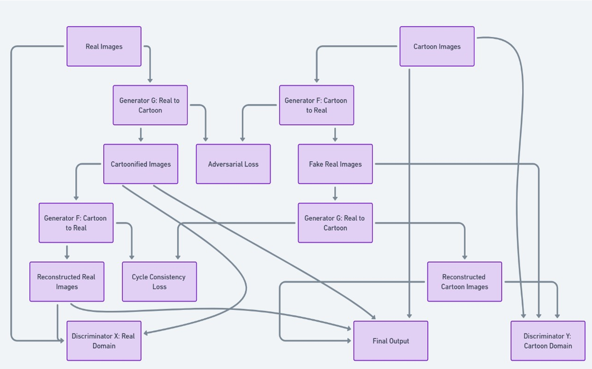
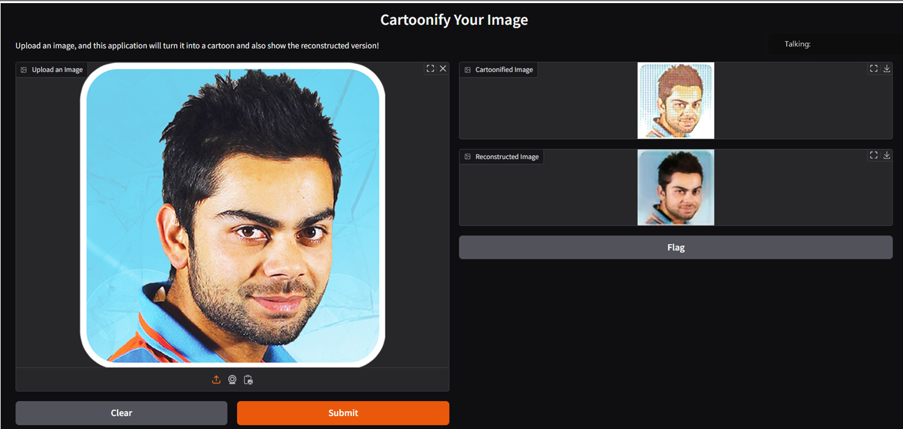

### Cartoonify an Image Using Deep Learning:
### Overview
This project uses a CycleGAN (Cycle-Consistent Generative Adversarial Network) to transform real-world images into cartoon-style images and reconstruct the original images from cartoonified ones. The project focuses on unpaired image-to-image translation, making it applicable in scenarios where paired datasets are unavailable.
### **Key Applications
•	Animation and movie production.
•	Creative filters for social media applications.
•	Content creation for gaming and virtual environments.
________________________________________
### **Links
### **•	Colab Notebook: 
    https://colab.research.google.com/drive/1XSke06UeqpXiNxBp_gf1X_LMKjs2GsNz?usp=sharing
### **•	GitHub Repository: 
    https://github.com/deepak-pvsn/DLFinalProject
### **•	Demo Video:
    https://drive.google.com/file/d/1f4Jf3_jHon5e7YQOzUf3NNc6mcIO7ifq/view?usp=drive_link________________________________________

### **Dataset
1.	Real Images: 1000 images from the CelebA dataset.
2.	Cartoon Images: Curated dataset with diverse cartoon-style visuals.
### **Preprocessing Steps
•	Resize images to 128x128 pixels.
•	Normalize pixel values to the range [-1, 1] for compatibility with neural networks.
•	Data augmentation (optional): Random rotations, flips, and zooming for training diversity.
________________________________________
### **Methodology
### **CycleGAN Framework
CycleGAN is a framework for unpaired image-to-image translation. It employs two generators and two discriminators:
### **1.	Generators: 
o	G: Transforms real-world images into cartoon-style images.
o	F: Transforms cartoon images back into real-world images.
### **2.	Discriminators: 
o	D_X: Ensures generated real-world images are indistinguishable from real ones.
o	D_Y: Ensures cartoonified images look authentic in the cartoon domain.
### **Training Flow
1.	Forward Pass: 
o	Real images → Cartoonified images → Reconstructed real images.
2.	Backward Pass: 
o	Cartoon images → Fake real images → Reconstructed cartoon images.
### **Loss Functions
### **1.	Adversarial Loss:
     Ensures the generated images are indistinguishable from real ones.
### **2.	Cycle Consistency Loss: 
    Preserves input structure by reconstructing the original image after transformations.
### **3.	Identity Loss:
    Ensures images already in the target domain remain unchanged.
________________________________________
### **Model Architecture

### **Implementation

### **Framework: TensorFlow and Keras.
### **Training Hyperparameters:
### **•	Epochs: 
    75
### **•	Batch Size:
    1
### **•	LAMBDA: 
    100 (Cycle Consistency Loss Weight)
### **Evaluation Metrics:
### **1.	Structural Similarity Index (SSIM): 
o	Measures similarity between real and reconstructed images.
o	Achieved: 0.81 (Real vs Reconstructed).
### **2.	Perceptual Loss: 
o	Measures feature-space differences using a pretrained VGG16 network.
o	Achieved: 239.7 (Real vs Cartoonified).
### ** Inference:
•	Gradio Interface: 
o	Upload images for real-time cartoonification.
o	Outputs both cartoonified and reconstructed images.
________________________________________
### **Results
### **Quantitative Results:
•	Perceptual Loss: 239.7 (effective feature preservation).
•	SSIM: 0.81 (high similarity between real and reconstructed images).
### **Qualitative Results:
•	Cartoon-style images exhibit high artistic quality.
•	Reconstructed images maintain structural similarity to input images.
________________________________________
### **Future Work
•	Train on larger and more diverse datasets for better generalization.
•	Incorporate advanced perceptual loss metrics to improve stylistic quality.
•	Extend the model to handle high-resolution inputs.
________________________________________
### **How to Run
Follow these steps to run the project:
### **1.	Clone the Repository:
        git clone: https://github.com/deepak-pvsn/DLFinalProject
        cd DLFinalProject
### **2.	Set Up the Environment:
o	Install the required dependencies: 
o	pip install tensorflow matplotlib
### **3.	Prepare the Dataset:
o	Place the real and cartoon images in the appropriate folders: 
	data/real: Contains real images.
	data/cartoon: Contains cartoon-style images.
### **4.	Run the Training Script:
o	Execute the Python script to train the model: 
o	python dlfinal.py
### **5.	Monitor Training:
o	Training progress will be displayed epoch by epoch in the terminal.
o	Sample outputs (real, cartoonified, and reconstructed images) will be displayed after each epoch.
### ** Output We got:

